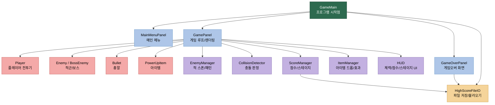
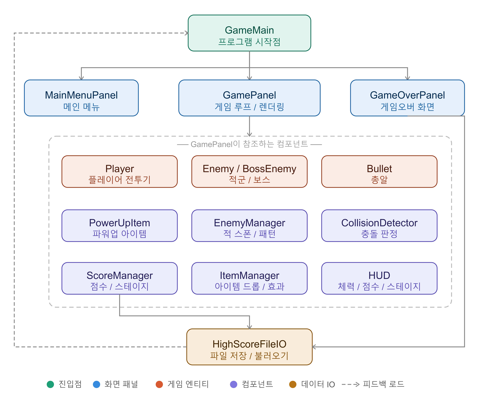
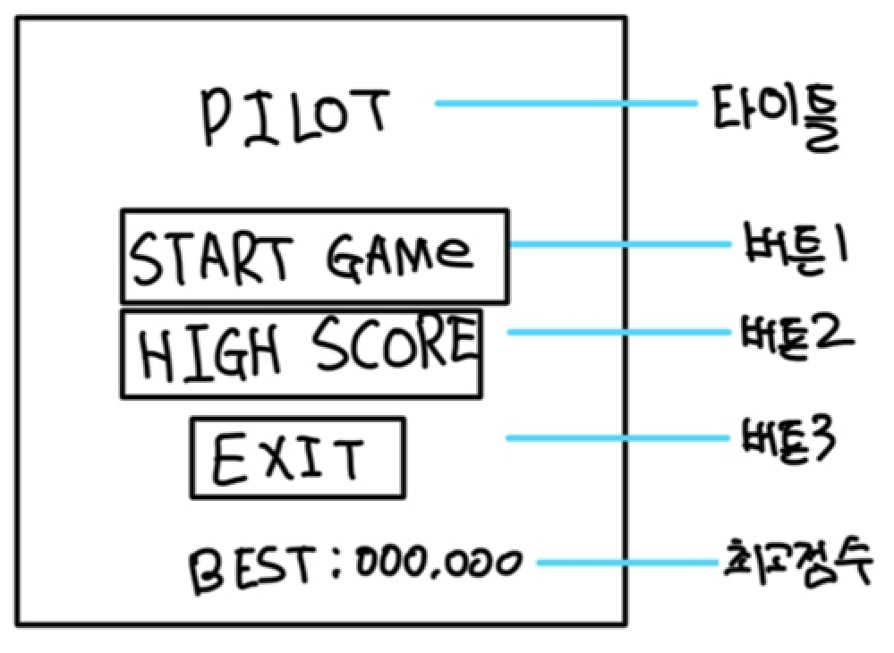
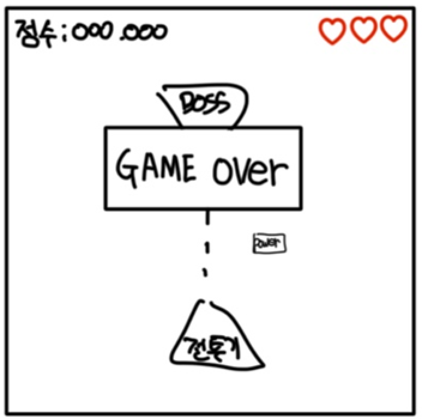

## **진행하는 프로젝트의 구조 및 역할분담을 기술한다.**
---

### 0-1. 기본 정보

| 항목 | 내용 |
|---|---|
| 프로젝트명 | PILOT 2D 횡스크롤 슈팅 게임 |
| 개발 기간 | 2026-05-20 ~ 2026-06-11 (약 3주, 실제 구현 기간) |
| 개발 언어 | Java (JDK 17 이상) |
| 주요 라이브러리 | `javax.swing`, `java.awt` |
| 개발 도구 | IntelliJ IDEA |
| 버전 관리 | Git / GitHub |
| 배포 형식 | 실행 가능한 JAR 파일 (`java -jar Pilot.jar`) |

### 0-2. 프로젝트 목표

- 제한된 기간 내 핵심 로직 구현부터 JAR 배포까지 완료
- 객체지향(OOP) 설계와 MVC 패턴 적용으로 유지보수성 확보
- 게임 루프, 충돌 감지, 파일 I/O 등 핵심 개념을 실습

### 0-3. 게임 기본 규칙

- 플레이어는 전투기를 조종해 적을 격추하며 점수를 획득한다.
- 일정 수의 적을 처치하면 보스가 등장하고, 보스 처치 시 다음 스테이지로 진행된다.
- 목숨(HP)이 0이 되면 게임오버, 최고점수는 파일에 저장된다.

---

## 1. 프로젝트 구조 설계

### 1-1. 기능/화면/시스템 구조 요약

| 구분 | 핵심 구성 요소 | 주요 역할 |
|---|---|---|
| 기능 구조 | 메뉴, 인게임, 게임오버, 저장/불러오기, 점수/스테이지, 보스전, 아이템 | 요구사항을 실제 동작 단위로 분해 |
| 화면 구조 | MainMenuPanel, GamePanel, GameOverPanel, HUD | 사용자가 직접 보게 되는 UI 영역 구성 |
| 시스템 구조 | main / screen / entity / manager / ui / util | 화면, 객체, 로직, 공통 기능을 계층화 |

### 1-2. 프로젝트 구조도 (기능 중심)

### 1-3. 요구사항-구성요소 매핑

> F-번호는 2주차 요구사항 명세서(`1_요구사항분석및설계/README.md`)의 기능 요구사항 ID와 대응된다.

| 요구사항 ID | 기능 요약 | 주요 클래스 | 연관 패키지 |
|---|---|---|---|
| F-01 메인 메뉴 표시 | 시작/종료 버튼 포함 메뉴 화면 | `MainMenuPanel` | `screen` |
| F-02 플레이어 이동 | 키보드 입력으로 상하좌우 이동 | `Player` | `entity` |
| F-03 단발 발사 | 스페이스바로 총알 생성 | `Player`, `Bullet` | `entity` |
| F-04 다중 발사 | 아이템 획득 시 확산 발사 | `Player`, `Bullet` | `entity` |
| F-05 적 스폰 | 웨이브 단위로 적 자동 생성 | `EnemyManager` | `manager` |
| F-06 보스 패턴 | 일정 처치 수 후 보스 등장·패턴 이동 | `BossEnemy`, `EnemyManager` | `entity`, `manager` |
| F-07 충돌 판정 | 총알-적, 적-플레이어 히트박스 감지 | `CollisionDetector` | `manager` |
| F-08 무적 시간 | 피격 후 일정 시간 무적 처리 | `Player` | `entity` |
| F-09 HP 관리 | HP 감소 및 0 도달 시 게임오버 전환 | `Player` | `entity` |
| F-10 점수·스테이지 | 적 처치 시 점수 증가, 조건 충족 시 스테이지 진행 | `ScoreManager`, `HUD` | `manager`, `ui` |
| F-11 아이템 드롭·효과 | 적 처치 시 확률 드롭 및 플레이어 효과 적용 | `ItemManager`, `PowerUpItem` | `manager`, `entity` |
| F-12 최고점수 저장 | 게임오버 시 최고점수 파일 저장·불러오기 | `HighScoreFileIO` | `util` |
| F-13 배경 스크롤 | 배경 이미지 반복 스크롤 렌더링 | `GamePanel` | `screen` |
| F-14 HUD 표시 | 체력·점수·스테이지 상시 표시 | `HUD` | `ui` |
| F-15 보스 경고 연출 | 보스 등장 전 경고 메시지 표시 | `HUD`, `GamePanel` | `ui`, `screen` |
| F-16 폭발 이펙트 | 적 파괴 시 시각 효과 | `GamePanel` | `screen` |
| F-17 일시정지 | ESC 키로 게임 루프 일시정지·재개 | `GamePanel` | `screen` |
### 1-4. 클래스 구조도

아래 구조도는 주요 클래스 간 참조 관계와 계층을 시각화한 것이다.
색상 범례: 진입점(초록) / 화면 패널(파랑) / 게임 엔티티(빨강) / 컴포넌트·매니저(보라) / 데이터 IO(노랑)

- `GameMain`이 세 화면 패널을 생성·전환하는 진입점 역할을 한다.
- `GamePanel`이 모든 엔티티와 매니저를 직접 참조하여 게임 루프를 구동한다.
- `ScoreManager`와 `GameOverPanel` 양쪽에서 `HighScoreFileIO`를 호출하는 구조로, 저장 시점을 두 곳에서 보장한다.
---

## 2. 역할 분담

| 팀원 | 담당 영역 | 세부 책임 |
|---|---|---|
| 임대훈 (20232526) | 화면/UI, 파일 저장, 문서화 | 메인 메뉴, 게임오버 화면, HUD, 최고점수 저장/불러오기, 최종 문서 정리 |
| 강민석 (20190665) | 게임 핵심 로직, 엔티티, 매니저 | 플레이어 이동/발사, 적 스폰, 보스 패턴, 충돌 판정, 점수/스테이지, 아이템 효과 |

### 협업 및 의사소통 방안

| 항목 | 운영 방식 |
|---|---|
| 주간 목표 공유 | 주 1회 진행 상황 점검 및 다음 주 할 일 재정의 |
| 이슈 관리 | GitHub Issue 또는 작업 목록으로 기능별 할 일 분리 |
| 코드 통합 | 기능 단위 브랜치 사용 후 PR/리뷰 방식으로 병합 |
| 충돌 방지 | 공통 클래스(`GameConstants`, `GameMain`, 데이터 모델)는 먼저 인터페이스를 합의 |
| 커뮤니케이션 | 변경사항은 작업 전 공유하고, 통합 전에는 실행 확인 후 전달 |

---

## 3. 일정 관리 계획

### 3-1. 일정 운영 원칙

- 실제 구현 기간은 **2026-05-20 ~ 2026-06-11 (약 3주)**로 계획한다.
- 1차 목표는 “플레이 가능 상태” 확보, 2차 목표는 “완성도 향상 및 안정화”이다.
- 각 주차별로 구현 / 통합 / 테스트를 분리하여 진행한다.

### 3-2. 주차별 세부 일정표
| 주차(날짜) | 목표 | 주요 작업 | 산출물 |
|---|---|---|---|
| 1주차 (05/20~05/26) | 구조 확정 및 기본 골격 구현 | 패키지 구조 생성, `GameMain`/`GamePanel` 기본 틀, 화면 전환, 공통 상수 정리, 플레이어 이동/발사 구현, 적 스폰 기본 구현 | 실행 가능한 기본 프레임, 구조도 초안, 기본 조작 동작 확인 |
| 2주차 (05/27~06/02) | 핵심 기능 구현 및 통합 | **강민석**: 충돌 판정, 점수/스테이지, 보스 패턴, 아이템 효과 구현 **임대훈**: HUD 구현, 게임오버 화면 연결 주차 말 통합 테스트 | 게임 플레이 가능한 버전(v1) |
| 3주차 (06/03~06/11) | 안정화 및 마감 | 버그 수정, 밸런싱, 저장/불러오기 최종 검증, JAR 패키징 | 최종 제출물 |

### 3-3. 마일스톤 및 중간 점검 계획

| 시점 | 점검 내용 | 확인 기준 |
|---|---|---|
| 1주차 말 | 구조와 책임 분리 확인 | 패키지 구조가 요구사항과 일치하는지, 기본 화면 전환이 동작하는지 |
| 2주차 말 | 핵심 기능 통합 확인 | 플레이어 이동, 발사, 적 등장, 충돌, 점수가 정상 동작하는지 |
| 3주차 말 | 통합 기능 확인 | 보스전, 아이템, 저장/불러오기, 게임오버 흐름 및 JAR 실행 확인 |

---

## 4. 설명 자료 및 이미지 첨부

### 4-1. 메인 화면

### 4-2. 인게임 화면

### 4-3. 게임오버 화면

---

