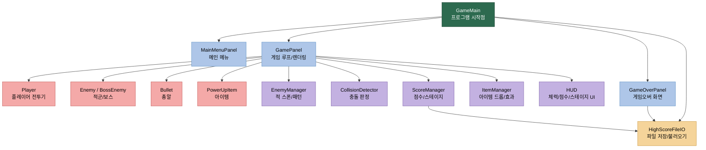
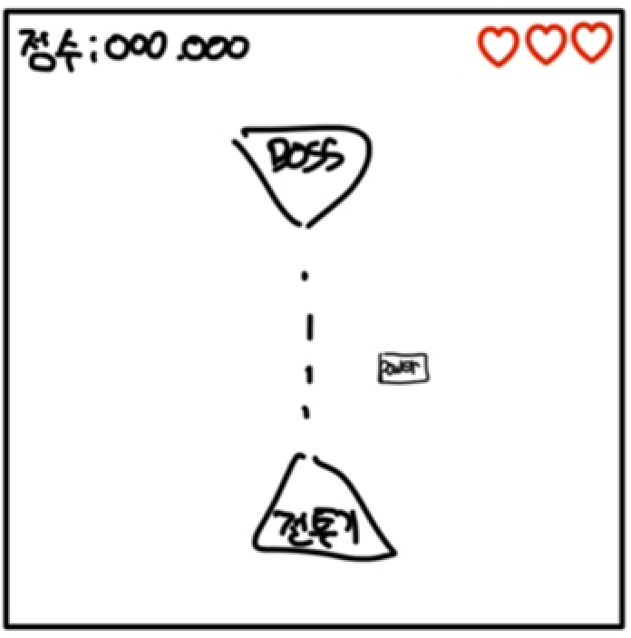

# Project Architecture and Schedule

본 문서는 `2_프로젝트구조및역할분담/README.md`의 내용을 제출용으로 정리한 문서이다.

---

## 0. 프로젝트 개요

### 0-1. 기본 정보

| 항목 | 내용 |
|---|---|
| 프로젝트명 | PILOT 2D 횡스크롤 슈팅 게임 |
| 개발 기간 | 2026-05-20 ~ 2026-06-11 (약 3주, 실제 구현 기간) |
| 개발 언어 | Java (JDK 17 이상) |
| 주요 라이브러리 | `javax.swing`, `java.awt` |
| 개발 도구 | IntelliJ IDEA |
| 버전 관리 | Git / GitHub |
| 배포 형식 | 실행 가능한 JAR 파일 (`java -jar Pilot.jar`) |

### 0-2. 팀 구성

| 역할 | 이름 | 학번 | 담당 분야 |
|---|---|---|---|
| 팀원 A | 임대훈 | 20232526 | UI/화면 구성, 문서화, 파일 I/O |
| 팀원 B | 강민석 | 20190665 | 게임 핵심 로직, 엔티티, 매니저 |

### 0-3. 프로젝트 목표

- 제한된 기간 내 핵심 로직 구현부터 JAR 배포까지 완료
- 객체지향(OOP) 설계와 MVC 패턴 적용으로 유지보수성 확보
- 게임 루프, 충돌 감지, 파일 I/O 등 핵심 개념을 실습

### 0-4. 게임 기본 규칙

- 플레이어는 전투기를 조종해 적을 격추하며 점수를 획득한다.
- 일정 수의 적을 처치하면 보스가 등장하고, 보스 처치 시 다음 스테이지로 진행된다.
- 목숨(HP)이 0이 되면 게임오버, 최고점수는 파일에 저장된다.

---

## 1. 프로젝트 구조 설계

### 1-1. 기능/화면/시스템 구조 요약

| 구분 | 핵심 구성 요소 | 주요 역할 |
|---|---|---|
| **기능 구조** | 메뉴, 인게임, 게임오버, 저장/불러오기, 점수/스테이지, 보스전, 아이템 | 요구사항을 실제 동작 단위로 분해 |
| **화면 구조** | MainMenuPanel, GamePanel, GameOverPanel, HUD | 사용자가 직접 보게 되는 UI 영역 구성 |
| **시스템 구조** | pilot.main / pilot.screen / pilot.entity / pilot.manager / pilot.ui / pilot.util | 화면, 객체, 로직, 공통 기능을 계층화 |

### 1-2. 전체 패키지 구조

```
PILOT/
├── src/
│   └── com/pilot/
│       ├── pilot.main/              # 진입점 및 게임 루프
│       │   ├── GameMain.java
│       │   ├── GameWindow.java
│       │   └── GamePanel.java  (핵심 게임 루프 60FPS)
│       │
│       ├── pilot.screen/            # 화면(Scene) 관리
│       │   ├── Screen.java
│       │   ├── MainMenuScreen.java
│       │   ├── GameScreen.java
│       │   ├── PauseScreen.java
│       │   └── GameOverScreen.java
│       │
│       ├── pilot.entity/            # 게임 오브젝트 (Model)
│       │   ├── Entity.java (abstract)
│       │   ├── Player.java
│       │   ├── Bullet.java
│       │   ├── enemy/
│       │   │   ├── Enemy.java (abstract)
│       │   │   ├── BasicEnemy.java
│       │   │   ├── FastEnemy.java
│       │   │   └── Boss.java
│       │   └── item/
│       │       ├── Item.java (abstract)
│       │       ├── PowerUpItem.java
│       │       └── LifeItem.java
│       │
│       ├── pilot.manager/           # 게임 로직 제어 (Controller)
│       │   ├── GameManager.java
│       │   ├── StageManager.java
│       │   ├── CollisionManager.java
│       │   ├── ScoreManager.java
│       │   └── SoundManager.java
│       │
│       ├── pilot.ui/                # HUD 및 화면 요소 (View)
│       │   ├── HUD.java
│       │   ├── StatusBar.java
│       │   └── Button.java
│       │
│       └── pilot.util/              # 공통 유틸리티
│           ├── Constants.java
│           ├── FileIO.java
│           └── ResourceLoader.java
│
├── resources/
│   ├── images/
│   └── sounds/
│
└── PILOT.jar
```

### 1-3. MVC 계층 구조도

```
┌─────────────────────────────────────┐
│     VIEW (화면 계층)                 │
│  ┌──────────┐  ┌──────────┐         │
│  │ Screen   │  │   HUD    │         │
│  │ (메뉴·   │  │ (체력·   │         │
│  │  게임·   │  │  점수)   │         │
│  │  게임오버)│  │          │         │
│  └──────────┘  └──────────┘         │
└────────────┬──────────────────────┘
             │
┌────────────▼──────────────────────┐
│  CONTROLLER (제어 계층)            │
│  ┌──────────────────────────────┐ │
│  │ GameManager, StageManager    │ │
│  │ CollisionManager, ScoreManager│ │
│  └──────────────────────────────┘ │
└────────────┬──────────────────────┘
             │
┌────────────▼──────────────────────┐
│   MODEL (데이터 계층)              │
│  ┌──────────┐  ┌──────────────┐  │
│  │ Player   │  │  Enemy/Boss  │  │
│  │ Bullet   │  │  Item        │  │
│  └──────────┘  └──────────────┘  │
└───────────────────────────────────┘
```

### 1-4. 요구사항-구성요소 매핑 테이블

| 요구사항 | 기능 요약 | 주요 클래스 | 담당 |
|---|---|---|---|
| F-01 | 메인 메뉴 UI | `MainMenuScreen`, `Button` | 팀원 A |
| F-02~F-04 | 이동/발사/다중발사 | `Player`, `Bullet` | 팀원 B |
| F-05~F-06 | 적 스폰/보스 패턴 | `StageManager`, `Boss` | 팀원 B |
| F-07~F-09 | 충돌/무적/HP | `CollisionManager`, `Player` | 팀원 B |
| F-10 | 점수/스테이지 | `ScoreManager`, `HUD` | 팀원 B |
| F-11 | 아이템 드롭/효과 | `ItemManager`, `PowerUpItem` | 팀원 B |
| F-12 | 최고점수 저장 | `HighScoreFileIO` | 팀원 A |
| F-13~F-16 | 그래픽/HUD/경고 | `GamePanel`, `HUD` | 팀원 A |
| F-17 | 일시정지 | `PauseScreen` | 팀원 A |

---

## 2. 역할 분담

### 2-1. 팀원별 담당 업무

| 구분 | 팀원 A (임대훈 / UI·문서) | 팀원 B (강민석 / 로직·엔티티) |
|---|---|---|
| **핵심 담당** | 화면 구성, 렌더링, 문서화 | 게임 로직, 물리, AI, 엔티티 |
| **패키지** | `pilot.screen`, `pilot.ui` (주요), `pilot.util` (일부) | `pilot.entity`, `pilot.manager`, `pilot.util` (일부) |
| **세부 작업** | MainMenuScreen, GameScreen, GameOverScreen 렌더링 | Player 이동/발사 로직 |
| | HUD 디자인 및 체력/점수/목숨 표시 | BasicEnemy, FastEnemy AI |
| | 배경 스크롤링 구현 | CollisionManager (AABB 충돌) |
| | 버튼 UI 컴포넌트 제작 | StageManager (웨이브 제어) |
| | 일시정지/게임오버 화면 처리 | ScoreManager (점수·저장) |
| | 최고점수 저장/불러오기 (FileIO) | Boss AI 및 다단계 패턴 |
| | 이펙트 및 전환 연출 | Item 구현 (파워업·회복) |
| | 최종 문서 정리 및 JAR 패키징 | 게임 루프 안정성 검증 |
| **공동 작업** | 전체 통합 테스트, 버그 수정, Git 리뷰 |

### 2-2. 책임 범위 정의

#### 팀원 A (임대훈) - UI/화면/문서

- `pilot.screen/` 패키지: 모든 화면 레이아웃 및 전환 로직
- `pilot.ui/` 패키지: HUD, 버튼, 상태바 구현
- `FileIO.java`: 최고점수 저장/불러오기
- 게임 렌더링 품질 및 시각적 완성도
- 배경 스크롤, 이펙트, 애니메이션 연출
- 최종 문서화 및 README 작성
- JAR 패키징 및 실행 검증

#### 팀원 B (강민석) - 게임 로직/엔티티/매니저

- `pilot.entity/` 패키지: Player, Bullet, Enemy, Item 구현
- `pilot.manager/` 패키지: 모든 매니저(GameManager, StageManager, CollisionManager, ScoreManager) 구현
- 60 FPS 게임 루프 안정성
- 충돌 판정 정확도 (AABB)
- 스테이지 밸런스 조정
- Enemy AI 및 Boss 패턴 설계

### 2-3. 협업 및 의사소통 방안

| 항목 | 운영 방식 |
|---|---|
| **주간 목표 공유** | 주 1회 진행 상황 점검 및 다음 주 할 일 재정의 |
| **이슈 관리** | GitHub Issue 또는 작업 목록으로 기능별 할 일 분리 |
| **코드 통합** | 기능 단위 브랜치 사용 후 PR/리뷰 방식으로 병합 |
| **충돌 방지** | 공통 클래스(GameConstants, GameMain, 데이터 모델)는 먼저 인터페이스를 합의 |
| **커뮤니케이션** | 변경사항은 작업 전 공유하고, 통합 전에는 실행 확인 후 전달 |

### 2-4. 인터페이스 계약

팀원 B가 제공하는 API (팀원 A가 호출):

```java
// GameManager - 현재 상태 조회
GameManager.getInstance().getCurrentState()
GameManager.getInstance().getPlayer()
GameManager.getInstance().getEnemyList()

// ScoreManager - 점수/목숨 조회
ScoreManager.getInstance().getScore()
ScoreManager.getInstance().getLives()
ScoreManager.getInstance().getHighScores()
```

---

## 3. 일정 관리 계획

### 3-1. 일정 운영 원칙

- 실제 구현 기간: **2026-05-20 ~ 2026-06-11 (약 3주)**
- 1차 목표: "플레이 가능 상태" 확보 (2주 완료)
- 2차 목표: "완성도 향상 및 안정화" (3주 완료)
- 각 주차별로 구현 / 통합 / 테스트를 분리하여 진행

### 3-2. 주차별 세부 일정표

| 주차 | 날짜 | 목표 | 주요 작업 |
|---|---|---|---|
| **1주차** | 05/20~05/26 | 구조 확정 및 기본 골격 구현 | • 패키지 구조 생성 및 클래스 스켈레톤 작성 |
| | | | • GameMain, GamePanel 기본 틀 |
| | | | • 화면 전환 로직 (MainMenuScreen → GameScreen) |
| | | | • GameConstants 정의 |
| **2주차** | 05/27~06/02 | 핵심 기능 구현 및 통합 | • Player 이동/발사 (팀원 B) |
| | | | • Enemy 스폰 및 AI (팀원 B) |
| | | | • CollisionManager 구현 (팀원 B) |
| | | | • ScoreManager 구현 (팀원 B) |
| | | | • GameScreen 렌더링 (팀원 A) |
| | | | • HUD 표시 (팀원 A) |
| | | | • 전체 통합 테스트 |
| **3주차** | 06/03~06/11 | 안정화 및 최종 완성 | • Boss AI 및 다단계 패턴 (팀원 B) |
| | | | • PowerUpItem, LifeItem 구현 (팀원 B) |
| | | | • 최고점수 저장/불러오기 (팀원 A) |
| | | | • 버그 수정 및 밸런싱 |
| | | | • JAR 패키징 및 최종 검증 |

### 3-3. 마일스톤 및 점검 목록

| 마일스톤 | 완료 시점 | 점검 항목 | 합격 기준 |
|---|---|---|---|
| **M1: 기본 골격** | 1주차 말 | • GamePanel 실행 여부 | • 메인메뉴 렌더링 성공 |
| | | • 화면 전환 동작 | • 클래스 구조 완성 |
| | | • 60 FPS 루프 안정성 | • CPU 정상 사용 |
| **M2: 게임플레이** | 2주차 말 | • Player 이동/발사 | • 적 등장 및 충돌 작동 |
| | | • Enemy 스폰 | • 점수 누적 |
| | | • 충돌 판정 | • Stage 클리어 가능 |
| | | • 점수 시스템 | • 게임오버 처리 |
| **M3: 완성** | 3주차 말 | • Boss 격파 | • JAR 단독 실행 가능 |
| | | • Item 효과 | • 최고점수 저장·불러오기 |
| | | • 전체 플레이 | • 버그 없음 |

---

## 4. 설명 자료 및 이미지

### 4-1. 메인 메뉴 화면 와이어프레임

메인 메뉴는 다음 요소를 포함:
- 게임 타이틀 ("PILOT")
- [게임 시작] 버튼
- [최고점수] 버튼
- [게임 종료] 버튼
- 배경 (스크롤 또는 고정)

### 4-2. 인게임 화면 구성

인게임 화면은 다음으로 구성:
- 게임 플레이 영역 (중앙)
- HUD (우측 상단): 체력, 점수, 목숨 표시
- 적, 플레이어, 총알, 아이템 렌더링
- 배경 무한 스크롤

### 4-3. 게임오버 화면

게임오버 시 표시:
- "GAME OVER" 텍스트
- 최종 점수
- [재시작] 버튼
- [메인으로] 버튼

---

## 5. 평가 포인트 대응 요약

### 5-1. 구조의 명확성
✅ 요구사항을 기능 구조 → 화면 구조 → 시스템 구조로 계층화 제시  
✅ 1-4 매핑 테이블로 각 기능 요소가 어느 클래스에서 구현되는지 명시

### 5-2. 역할 분담의 적절성
✅ 팀원별 담당 패키지를 명확히 구분 (A: pilot.screen/pilot.ui, B: pilot.entity/pilot.manager)  
✅ 공동 작업 항목과 인터페이스 계약으로 협업 가능성 확보

### 5-3. 일정 계획의 현실성
✅ 실제 구현 기간 3주 기준으로 주차별 목표 설정  
✅ M1→M2→M3 마일스톤으로 진행 상황 점검 가능  
✅ 각 주차별 구현 항목이 실현 가능한 수준으로 분할

### 5-4. 문서 정리의 완성도
✅ 표/다이어그램으로 구조와 일정 가독성 확보  
✅ 각 섹션별 명확한 설명과 요약으로 이해 용이  
✅ MVC 패턴과 OOP 원칙 명시

---

## 6. 최종 제출용 요약

### 6-1. 프로젝트 핵심 사항

| 항목 | 내용 |
|---|---|
| **구조** | `pilot.main → pilot.screen → pilot.entity/pilot.manager → pilot.util` 계층 구조 |
| **역할 분담** | 임대훈(UI/문서) & 강민석(로직/엔티티) |
| **일정** | 2026-05-20 ~ 2026-06-11 (약 3주) |
| **목표** | 실행 가능한 JAR 배포 |
| **마일스톤** | M1(기본 골격) → M2(게임플레이) → M3(완성) |

### 6-2. 협업 방식

1. **주간 계획**: 매주 월요일 목표 합의
2. **작업 분담**: 팀원별 책임 범위 명확히 구분
3. **인터페이스 계약**: 공통 클래스 먼저 설계 후 구현
4. **통합 검증**: 기능 단위 PR 리뷰 후 병합

### 6-3. 제출 체크리스트

- [ ] 모든 클래스 스켈레톤 작성 완료
- [ ] GamePanel 60 FPS 루프 동작 확인
- [ ] Player 이동/발사 구현 완료
- [ ] Enemy/Boss AI 구현 완료
- [ ] CollisionManager 동작 확인
- [ ] ScoreManager 및 최고점수 저장 검증
- [ ] 모든 화면 렌더링 정상 동작
- [ ] JAR 패키징 및 독립 실행 확인
- [ ] 최종 문서화 완료

---

**문서 작성일**: 3주차  
**최종 수정일**: 3주차 마일스톤 완료 후 갱신 예정

## **진행하는 프로젝트의 구조 및 역할분담을 기술한다.**
---

### 0-1. 기본 정보

| 항목 | 내용 |
|---|---|
| 프로젝트명 | PILOT 2D 횡스크롤 슈팅 게임 |
| 개발 기간 | 2026-05-20 ~ 2026-06-11 (약 3주, 실제 구현 기간) |
| 개발 언어 | Java (JDK 17 이상) |
| 주요 라이브러리 | `javax.swing`, `java.awt` |
| 개발 도구 | IntelliJ IDEA |
| 버전 관리 | Git / GitHub |
| 배포 형식 | 실행 가능한 JAR 파일 (`java -jar Pilot.jar`) |

### 0-2. 프로젝트 목표

- 제한된 기간 내 핵심 로직 구현부터 JAR 배포까지 완료
- 객체지향(OOP) 설계와 MVC 패턴 적용으로 유지보수성 확보
- 게임 루프, 충돌 감지, 파일 I/O 등 핵심 개념을 실습

### 0-3. 게임 기본 규칙

- 플레이어는 전투기를 조종해 적을 격추하며 점수를 획득한다.
- 일정 수의 적을 처치하면 보스가 등장하고, 보스 처치 시 다음 스테이지로 진행된다.
- 목숨(HP)이 0이 되면 게임오버, 최고점수는 파일에 저장된다.

---

## 1. 프로젝트 구조 설계

### 1-1. 기능/화면/시스템 구조 요약

| 구분 | 핵심 구성 요소 | 주요 역할 |
|---|---|---|
| 기능 구조 | 메뉴, 인게임, 게임오버, 저장/불러오기, 점수/스테이지, 보스전, 아이템 | 요구사항을 실제 동작 단위로 분해 |
| 화면 구조 | MainMenuPanel, GamePanel, GameOverPanel, HUD | 사용자가 직접 보게 되는 UI 영역 구성 |
| 시스템 구조 | pilot.main / pilot.screen / pilot.entity / pilot.manager / pilot.ui / pilot.util | 화면, 객체, 로직, 공통 기능을 계층화 |

### 1-2. 프로젝트 구조도 (기능 중심)


### 1-3. 요구사항-구성요소 매핑

> F-번호는 2주차 요구사항 명세서(`1_요구사항분석및설계/README.md`)의 기능 요구사항 ID와 대응된다.

| 요구사항 ID | 기능 요약 | 주요 클래스 | 연관 패키지 |
|---|---|---|---|
| F-01 메인 메뉴 표시 | 시작/종료 버튼 포함 메뉴 화면 | `MainMenuPanel` | `pilot.screen` |
| F-02 플레이어 이동 | 키보드 입력으로 상하좌우 이동 | `Player` | `pilot.entity` |
| F-03 단발 발사 | 스페이스바로 총알 생성 | `Player`, `Bullet` | `pilot.entity` |
| F-04 다중 발사 | 아이템 획득 시 확산 발사 | `Player`, `Bullet` | `pilot.entity` |
| F-05 적 스폰 | 웨이브 단위로 적 자동 생성 | `EnemyManager` | `pilot.manager` |
| F-06 보스 패턴 | 일정 처치 수 후 보스 등장·패턴 이동 | `BossEnemy`, `EnemyManager` | `pilot.entity`, `pilot.manager` |
| F-07 충돌 판정 | 총알-적, 적-플레이어 히트박스 감지 | `CollisionDetector` | `pilot.manager` |
| F-08 무적 시간 | 피격 후 일정 시간 무적 처리 | `Player` | `pilot.entity` |
| F-09 HP 관리 | HP 감소 및 0 도달 시 게임오버 전환 | `Player` | `pilot.entity` |
| F-10 점수·스테이지 | 적 처치 시 점수 증가, 조건 충족 시 스테이지 진행 | `ScoreManager`, `HUD` | `pilot.manager`, `pilot.ui` |
| F-11 아이템 드롭·효과 | 적 처치 시 확률 드롭 및 플레이어 효과 적용 | `ItemManager`, `PowerUpItem` | `pilot.manager`, `pilot.entity` |
| F-12 최고점수 저장 | 게임오버 시 최고점수 파일 저장·불러오기 | `HighScoreFileIO` | `pilot.util` |
| F-13 배경 스크롤 | 배경 이미지 반복 스크롤 렌더링 | `GamePanel` | `pilot.screen` |
| F-14 HUD 표시 | 체력·점수·스테이지 상시 표시 | `HUD` | `pilot.ui` |
| F-15 보스 경고 연출 | 보스 등장 전 경고 메시지 표시 | `HUD`, `GamePanel` | `pilot.ui`, `pilot.screen` |
| F-16 폭발 이펙트 | 적 파괴 시 시각 효과 | `GamePanel` | `pilot.screen` |
| F-17 일시정지 | ESC 키로 게임 루프 일시정지·재개 | `GamePanel` | `pilot.screen` |
### 1-4. 클래스 구조도

아래 구조도는 주요 클래스 간 참조 관계와 계층을 시각화한 것이다.
색상 범례: 진입점(초록) / 화면 패널(파랑) / 게임 엔티티(빨강) / 컴포넌트·매니저(보라) / 데이터 IO(노랑)


- `GameMain`이 세 화면 패널을 생성·전환하는 진입점 역할을 한다.
- `GamePanel`이 모든 엔티티와 매니저를 직접 참조하여 게임 루프를 구동한다.
- `ScoreManager`와 `GameOverPanel` 양쪽에서 `HighScoreFileIO`를 호출하는 구조로, 저장 시점을 두 곳에서 보장한다.
---

## 2. 역할 분담

> **분담의 설계적 이점:** 화면(UI) 영역과 핵심 게임 로직(Entity/Manager) 영역을 명확히 분리하여 동시 작업 시 Git 병합 충돌(Merge Conflict)을 최소화하고, MVC 패턴에 입각한 독립적인 모듈 개발이 가능하도록 구성했습니다.

| 팀원 | 담당 영역 | 세부 책임 |
|---|---|---|
| 임대훈 (20232526) | 화면/UI, 파일 저장, 문서화 | 메인 메뉴, 게임오버 화면, HUD, 최고점수 저장/불러오기, 최종 문서 정리 |
| 강민석 (20190665) | 게임 핵심 로직, 엔티티, 매니저 | 플레이어 이동/발사, 적 스폰, 보스 패턴, 충돌 판정, 점수/스테이지, 아이템 효과 |

### 협업 및 의사소통 방안

| 항목 | 운영 방식 |
|---|---|
| 주간 목표 공유 | 주 1회 진행 상황 점검 및 다음 주 할 일 재정의 |
| 이슈 관리 | GitHub Issue 또는 작업 목록으로 기능별 할 일 분리 |
| 코드 통합 | 기능 단위 브랜치 사용 후 PR/리뷰 방식으로 병합 |
| 충돌 방지 | 공통 클래스(`GameConstants`, `GameMain`, 데이터 모델)는 먼저 인터페이스를 합의 |
| 커뮤니케이션 | 변경사항은 작업 전 공유하고, 통합 전에는 실행 확인 후 전달 |

---

## 3. 일정 관리 계획

### 3-1. 일정 운영 원칙

- 실제 구현 기간은 **2026-05-20 ~ 2026-06-11 (약 3주)**로 계획한다.
- 1차 목표는 “플레이 가능 상태” 확보, 2차 목표는 “완성도 향상 및 안정화”이다.
- 각 주차별로 구현 / 통합 / 테스트를 분리하여 진행한다.

### 3-2. 주차별 세부 일정표
| 주차(날짜) | 목표 | 주요 작업 | 산출물 |
|---|---|---|---|
| 1주차 (05/20~05/26) | 구조 확정 및 기본 골격 구현 | 패키지 구조 생성, `GameMain`/`GamePanel` 기본 틀, 화면 전환, 공통 상수 정리, 플레이어 이동/발사 구현, 적 스폰 기본 구현 | 실행 가능한 기본 프레임, 구조도 초안, 기본 조작 동작 확인 |
| 2주차 (05/27~06/02) | 핵심 기능 구현 및 통합 | **강민석**: 충돌 판정, 점수/스테이지, 보스 패턴, 아이템 효과 구현<br>**임대훈**: HUD 구현, 게임오버 화면 연결<br>주차 말 통합 테스트 | 게임 플레이 가능한 버전(v1) |
| 3주차 (06/03~06/11) | QA, 안정화 및 최종 마감 | 버그 수정, 난이도 밸런싱, 예기치 않은 이슈 대응을 위한 **버퍼(Buffer) 기간 운영**, 저장/불러오기 최종 검증, JAR 패키징 및 최종 실행 테스트 | 최종 제출물 |
### 3-3. 마일스톤 및 중간 점검 계획

| 시점 | 점검 내용 | 확인 기준 |
|---|---|---|
| 1주차 말 | 구조와 책임 분리 확인 | 패키지 구조가 요구사항과 일치하는지, 기본 화면 전환이 동작하는지 |
| 2주차 말 | 핵심 기능 통합 확인 | 플레이어 이동, 발사, 적 등장, 충돌, 점수가 정상 동작하는지 |
| 3주차 말 | 통합 기능 확인 | 보스전, 아이템, 저장/불러오기, 게임오버 흐름 및 JAR 실행 확인 |

---

## 4. 설명 자료 및 이미지 첨부

### 4-1. 메인 화면


### 4-2. 인게임 화면



### 4-3. 게임오버 화면


---


